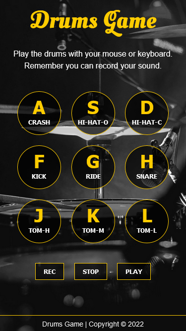

# Play drums 🥁

## Introduction 📝

_Play drums project is a Javascript app to have some fun playing drums. It allows you to play different sounds by clicking buttons in the app or pressing some keys in your keyboard._

_We decided to pair most of the time in order to solve problems in partnership. Having an extra pair of eyes on the code helps us to face issues._

[Play drums web](https://play-drums.vercel.app/)

## Solution

### Mobile version 📱

### Desktop version 💻

## Built with 🛠️

- Semantic HTML5 markup
- Flexbox
- CSS Grid
- Javascript (ES6)
- Mobile first workflow
- Sweet Alert 2

## Tools 🧰

- Trello
- Excalidraw
- Zoom
- Visual Studio Code
- Git/Github
- Vercel (deployment)

## Authors 👩🏽‍💻

- [Claudia Campos](https://github.com/clauCampos)
- [Yasmín Lorenzo](https://github.com/yassscoder)

### Thanks for checking our project 🙏🏼

If you have enjoyed visiting this web, tell others about this project 📢
